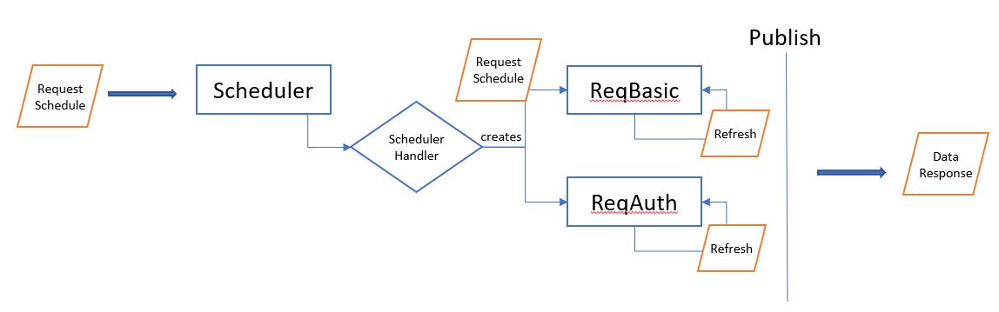
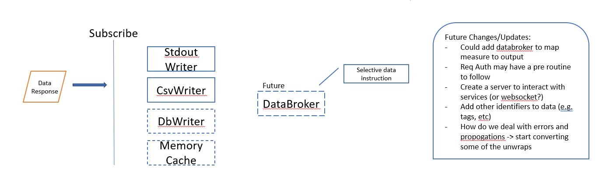
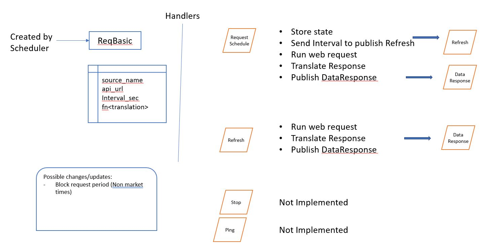

# Developing in Real-time.  Not a useable product!

Thoughts around building an Data Watch framework in Rust that would allow me to stream data from multiple API that would used for alerts, storage, or viewing.

Setup using an actor framework.

# Starting Project

1) Develop a generic way to descript API extraction requests and a data structure to return.

2) Building out a scheduler to deal with managing multiple API endpoints on an interval

3) Ability of pass a transpormation function that allows response to be converted to time series data

4) Listen for clean data for storage in memory or store on disk/db

# First Product - Actor and Message setup

# Big Vision / Future Considerations
Probably a bit too large in that it won't do anything well.  Start project and then narrow in on a few of these components.  Also could split this into multiple projects.

### Scheduler
- (start) batch pull
- streaming pull
- batch push
- streaming push 

### Extraction Request
- (start) api (no auth)
- api (static auth)
- api (dynamic auth)

### Data
- single timeseries definition
- able to combine data to create new timeseries data

### Store
- (start) memory
- (start) csv/filefolders
- database

### Interaction tools
- server
- api to grab data in memory
- cli
- configuration file?

### Monitoring - for using the data
- Alerts
- Spawn tasks when alerts hit

